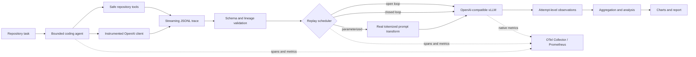

# AgentTrace

**Coding-Agent Inference Workload Profiler**

AgentTrace captures the inference workload produced by bounded coding agents, replays
that workload against an OpenAI-compatible server, and measures how prompt growth,
tool waits, request concurrency, and subagent activity interact with LLM serving.
It is an experimental systems toolkit: raw observations, failures, provenance, and
unsupported metrics remain visible instead of being turned into invented conclusions.

The central research question is:

> How do context growth, tool interactions, and concurrent agent execution affect
> inference latency, throughput, and resource utilization when coding agents share an
> LLM serving infrastructure?

## What works

- A typed, bounded coding-agent loop can inspect files, search, edit, create files, and
  run allowlisted validation commands in an isolated repository copy.
- Every successful or failed LLM request records ordering, wall and monotonic timing,
  role-level token counts, prompt growth, sampling parameters, concurrency, and tool
  lineage in a versioned streaming JSONL trace.
- Independent agents and parent/child agents retain separate histories while sharing
  an experiment and trace identity.
- Open-loop, closed-loop, and explicitly parameterized workloads replay through a
  streamed OpenAI-compatible API. Retries are separate attempt records.
- Benchmark matrices rotate or randomize case order, separate warmups, retain raw
  observations, aggregate supported statistics, and generate labeled charts/reports.
- OpenTelemetry spans, structured correlation logs, client Prometheus metrics, and a
  version-aware vLLM metrics adapter separate client and server observations.
- The CPU mock endpoint provides deterministic delays, streaming chunks, usage data,
  and injected failures without model downloads. Its results are always labeled mock.

## Architecture



The package preserves boundaries between `agent`, `instrumentation`, `tracing`,
`replay`, `serving`, `benchmarking`, `analysis`, and `telemetry`. Pydantic models are
strict at configuration and trace boundaries.

## Install

Python 3.11 or newer is required. CPU development does not install PyTorch, vLLM,
Transformers, or model weights.

```bash
git clone https://github.com/Karthikvenugopal/AgentTrace.git
cd AgentTrace
python3 -m venv .venv
. .venv/bin/activate
pip install -e '.[dev]'
```

Optional extras are `agenttrace[tokenizers]`, `agenttrace[telemetry]`, and
`agenttrace[gpu]`. Install the GPU extra only on a vLLM-supported CUDA host.

## CPU-only end-to-end demonstration

In terminal one, start the explicitly simulated endpoint:

```bash
agenttrace mock-server --port 8010
```

In terminal two:

```bash
agenttrace agent run --config configs/agent.yaml
agenttrace trace validate --input examples/traces/mock-agent.jsonl
agenttrace trace summarize --input examples/traces/mock-agent.jsonl
agenttrace replay run \
  --trace examples/traces/mock-agent.jsonl \
  --config configs/replay.yaml \
  --output results/mock-replay.json
AGENTTRACE_VLLM_METRICS_URL=http://127.0.0.1:8010/metrics \
  agenttrace benchmark run --config configs/benchmark.yaml
```

The agent reads the intentionally broken `tiny_math` fixture, replaces the faulty
implementation, runs pytest, observes the result, and finishes. Its workspace is a
temporary copy. A previously generated run is in
[`examples/traces/mock-agent.jsonl`](examples/traces/mock-agent.jsonl), and the
published demonstration report is
[`examples/results/mock-matrix-demo/report.md`](examples/results/mock-matrix-demo/report.md).
Those latency values are simulated transport measurements, not LLM performance.

Docker can run the same mock server without local Python setup:

```bash
docker compose --profile demo up --build mock-server
```

## Coding-agent execution

`configs/agent.yaml` controls the endpoint, sampling, iteration/wall-time/token
budgets, allowed commands, output limit, workspace isolation, and trace privacy.
Commands are argument arrays executed without a shell. Absolute paths, traversal,
direct `.git` access, unknown tools, and non-allowlisted executables are rejected.

For a real endpoint, copy that configuration, set `endpoint.base_url` and `model`,
and point `workspace.root` at a repository. `isolated_copy: true` excludes `.git`,
`.env`, keys, virtual environments, and dependency trees from the temporary copy.
Set it to false only when you intentionally want edits applied to the source tree.

## Trace collection and privacy

Each JSONL line is a schema-versioned header, agent, request, tool call, or outcome
record. The first record carries environment/configuration metadata. Trace validation
checks duplicate or missing IDs, timestamp ordering, request sequences, parent cycles,
tool lineage, and incomplete outcomes.

Content policies are:

- `metadata_only`: stores no prompt or message content and cannot exactly replay it.
- `redacted`: removes all content by default, or applies configured regex patterns.
- `full`: stores content, with optional secret-redaction regexes. Use only for public or
  reviewed repositories.

API keys and authorization headers never enter trace models. The client-side tokenizer
identity, counting method, server usage, and discrepancy are retained separately.

```bash
agenttrace trace generate --config configs/synthetic.yaml
agenttrace trace validate --input traces/synthetic.jsonl
agenttrace trace summarize --input traces/synthetic.jsonl
```

Synthetic headers and manifests say `synthetic`; they are not agent measurements.

## Replay semantics

- **Open loop** schedules each recorded arrival relative to the session clock without
  waiting for earlier responses, subject to a client semaphore.
- **Closed loop** keeps independent agent streams, but an agent's next request waits for
  its prior response and then its recorded think/tool delay.
- **Parameterized** creates a derived workload with a manifest, seed, lineage, and
  actual prompt text whose tokenizer count matches the requested content-token target.

Replay sends inference requests; it does not reproduce autonomous tool decisions or
repository state. `configs/replay-parameterized.yaml` demonstrates prompt size,
output size, agent count, arrival rate, tool wait, subagents, and execution length.

## Real vLLM benchmark

The default GPU profile serves `Qwen/Qwen2.5-Coder-0.5B-Instruct`; it is configurable
and is not downloaded during CPU setup. A single modern CUDA GPU with at least 8 GB is
a practical starting point for this 0.5B model and the supplied conservative settings,
but required memory varies with dtype, context length, concurrency, vLLM release, and
KV-cache settings. Treat `nvidia-smi` and vLLM startup output as authoritative.

```bash
docker compose -f docker-compose.gpu.yml up --build vllm
AGENTTRACE_VLLM_METRICS_URL=http://127.0.0.1:8000/metrics \
  agenttrace benchmark run --config configs/benchmark-gpu.yaml
agenttrace benchmark report --results results/vllm-single-gpu
```

For one smaller experiment, reduce each matrix list in a copy of
`configs/benchmark-gpu.yaml` to one value. Record changes to model length, batching,
prefix caching, dtype, and GPU memory utilization in `server_metadata`.

## Metrics and observability

Client metrics use the `agenttrace_client_` prefix. vLLM native metrics retain their
server names. Request IDs and paths are never Prometheus labels. TTFT is the time to
the first non-empty streamed chunk; it is not queueing time. A chunk may contain more
than one token, so chunk arrival intervals are not claimed as per-token decode latency.

```bash
docker compose up -d otel-collector prometheus grafana
curl -fsS http://127.0.0.1:13133/        # collector health
curl -fsS http://127.0.0.1:9090/-/ready  # Prometheus readiness
curl -fsS http://127.0.0.1:9090/api/v1/targets
```

Set `OTEL_EXPORTER_OTLP_ENDPOINT=http://127.0.0.1:4318` when configuring export, and
serve application metrics on port 9464. Collector debug-exported spans appear in
`docker compose logs otel-collector`. Grafana is at `http://127.0.0.1:3000` with an
anonymously viewable provisioned dashboard. See [observability](docs/observability.md).

## Testing

```bash
ruff format --check .
ruff check .
mypy agenttrace
pytest -m 'not gpu' -q
```

The tests cover schema rules, accounting, request/context ordering, tool recording,
streaming, TTFT/chunk timing, replay semantics, retries, prompt transforms, concurrent
agents, aggregation, reports, CLI workflows, and a real HTTP mock endpoint. GPU tests
are skipped locally unless explicitly requested; the manual GPU workflow fails if CUDA
or vLLM is unavailable rather than reporting a pass.

```bash
AGENTTRACE_RUN_GPU_TESTS=1 \
AGENTTRACE_VLLM_URL=http://127.0.0.1:8000/v1 \
AGENTTRACE_VLLM_MODEL=qwen-coder-small \
pytest -m gpu -vv
```

## Research documentation

- [Metric methodology](docs/methodology.md)
- [Reproducibility guide](docs/reproducibility.md)
- [Trace schema](docs/trace-schema.md)
- [Observability verification](docs/observability.md)
- [Threats to validity and limitations](docs/limitations.md)

## Limitations and future work

Exact request-level vLLM queue, prefill, or decode timing is unavailable unless the
connected release exports and correlates it. Aggregate server histograms are kept
separate. The fallback whitespace counter is suitable for controlled tests, not exact
model accounting; use the model tokenizer for GPU studies. Replay cannot recreate
model-dependent agent branching. Mock results validate mechanics, not GPU behavior.

Future work includes backend request-span correlation, arrival models learned from
larger public traces, energy telemetry, distributed replay clients, cache-state
controls, and statistically powered multi-hardware studies.

AgentTrace is licensed under the [MIT License](LICENSE).
